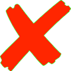
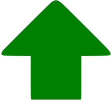
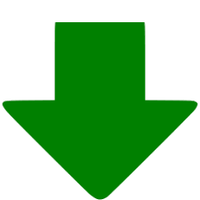
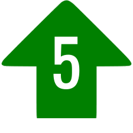
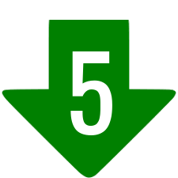
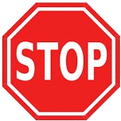
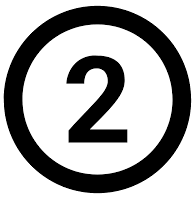
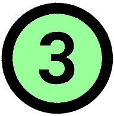
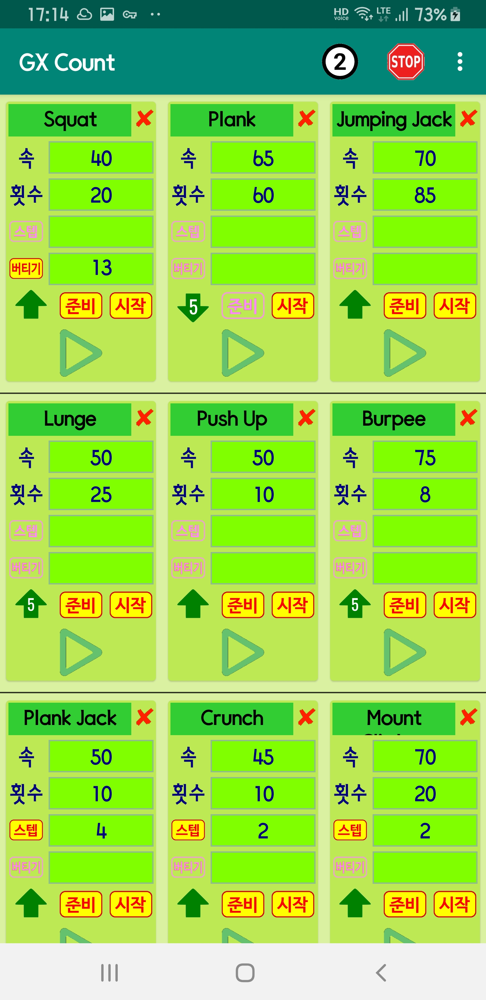
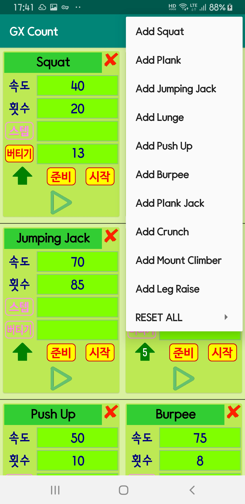

# Gym Count
**Gym Count** is the android application to assist self gym counting

- You can set various gym style (currently 6 cases) 
- Following are settable
  - Speed
  - Counts
  - Step count
  - Keep Staying after main count
  - Counting Up or Down
  - Say Ready or not, Say Start or not
    
<H1>Screenshots and How to operate</H1>

<H3> Main Screen</H3>

- There are several default cards for your various gym style, e.g. Jumping Jack, Squat, Prank, ..

- You may set card name at the top just for reference later

-  on the right of **EXERCISE NAME** is for deleting that exercise type

- You may settle **SPEED**   , **MAIN COUNT**   by clicking number itself

- &nbsp;&nbsp; will play **STEP COUNT** for each main count

- &nbsp;&nbsp;is for **HOLDING** some seconds after your excercise, e.g. 20 squat and the hold 10 secs with folding your knees

- ,  ,  ,   is switch for counting UP or DOWN

- ,  says count ALL the count, but  ,  says nothing while remaining count is FIVE. It will be weired if step flag is on. 

- &nbsp;&nbsp;is whether to say **READY** or not
- &nbsp;&nbsp;is whether to say **START** or not
- By pressing &nbsp;&nbsp; Count up/down is started and  (gif file) will run with you
- By pressing &nbsp;&nbsp; again counting will be stopped
- &nbsp;&nbsp; on top right button also can be used to stop shouting

- ,&nbsp;&nbsp; on top is for switching column count.

 &nbsp;&nbsp;&nbsp;&nbsp;&nbsp;&nbsp;&nbsp;&nbsp;&nbsp;&nbsp;&nbsp;&nbsp;

  &nbsp;&nbsp;&nbsp;&nbsp;&nbsp;&nbsp;&nbsp;&nbsp;&nbsp;&nbsp;&nbsp;&nbsp;

<H3>Adjust Count /Sub Count</H3>

- Horizontal Wheel is used to change count/sub count value

 &nbsp;&nbsp;&nbsp;&nbsp;&nbsp;&nbsp;&nbsp;&nbsp;&nbsp;&nbsp;&nbsp;&nbsp;

    
<H3>Add new exercise type</H3>

- Three dot menu will lead you to add new exercise type 

 &nbsp;&nbsp;&nbsp;&nbsp;&nbsp;&nbsp;&nbsp;&nbsp;&nbsp;&nbsp;&nbsp;&nbsp;

<H1>Comments</H1>

- ~~My Personal Trainer's voices (Ready, Start, One, Two, Stop ..mp3) are not included~~ My Personal Trainer's voices is gone, but mine is uploaded

<H3>Coded by</H3>

-  **Woncherl Ha** - riopapa@gmail.com

<H3>What I learned in this application</H3>

- Customized Wheel, Recyclable card , gif file handling

<H3>Major Updates / Changes</H3>

- 2020.01.03 column count (two or three) applied

<H3>Issues not fixed yet</H3>

<H3>Thanks all persons in GitHub for good examples.</H3>

