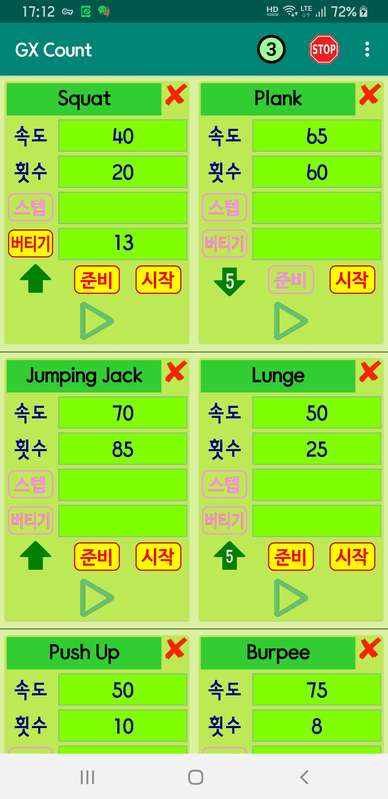
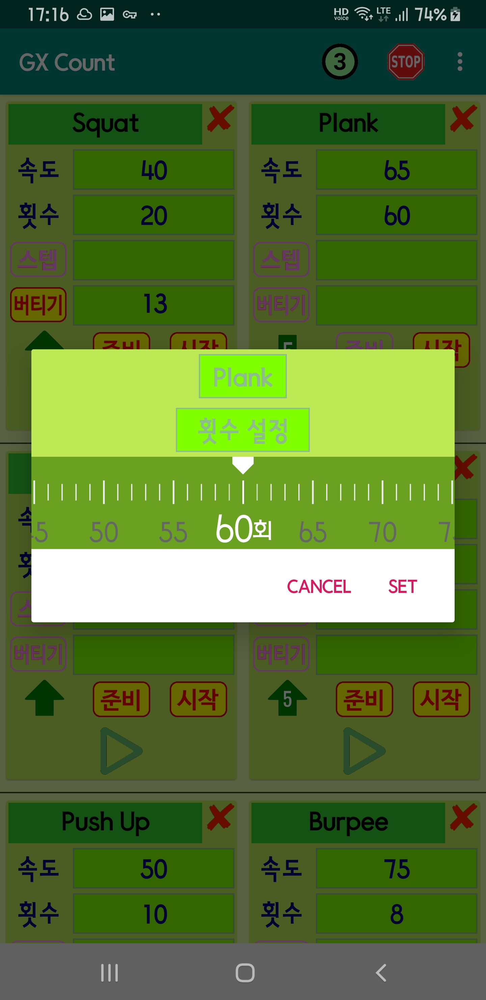

# GX Count
**GX Count** is the android application to assist self gym counting

- You can set various gym style (currently 6 cases) 
- Following are settable
  - Counting Up or Down, Number of Count
  - Sub count or Keep Staying
  - Speed for counting
  - Say Ready or not, Say Start or not
    
<H1>Screenshots and How to operate</H1>

<H3> Main Screen</H3>

- There are six cards for your various gym style, e.g. Jumping Jack, Squat, Frank, ..
- You may set card name at the top
- Slide bar is for adjusting speed, approx 0.8x ~ 1.5x
- Arrow Up/Down is for counting up or down
- Number on right of arrow is how many times you want to count (max 60)
- &nbsp;&nbsp;is count for keep the position steady 
- &nbsp;&nbsp;is sub count for each up/down count 
- &nbsp;&nbsp;is whether to say "READY" or not
- &nbsp;&nbsp;is whether to say "START" or not

- By pressing &nbsp;&nbsp; Count up/down is started and  will be changed to 

- By pressing &nbsp;&nbsp; again counting will be stopped
- &nbsp;&nbsp; on top right button can be used to stop counting

 &nbsp;&nbsp;&nbsp;&nbsp;&nbsp;&nbsp;&nbsp;&nbsp;&nbsp;&nbsp;&nbsp;&nbsp;

<H3>Adjust Count /Sub Count</H3>

- Horizontal Wheel is used to change count/sub count value

 &nbsp;&nbsp;&nbsp;&nbsp;&nbsp;&nbsp;&nbsp;&nbsp;&nbsp;&nbsp;&nbsp;&nbsp;

    
<H1>Comments</H1>

- My Personal Trainer's voice (Ready, Start, One, Two, Stop ..) is not included

<H3>Coded by</H3>

-  **Woncherl Ha** - riopapa@gmail.com

<H3>What I learned in this application</H3>

- Customized Wheel, Recyclable card 

<H3>Major Updates / Changes</H3>

<H3>Issues not fixed yet</H3>

<H3>Thanks all persons in GitHub for good examples.</H3>

